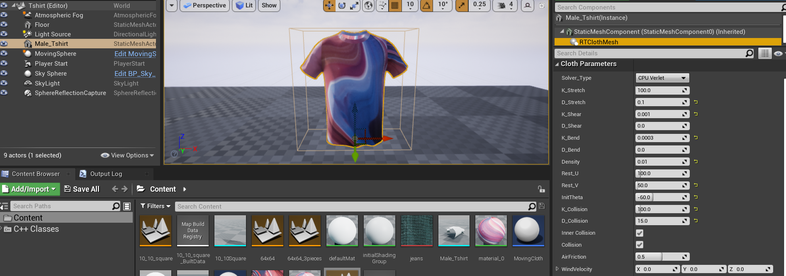
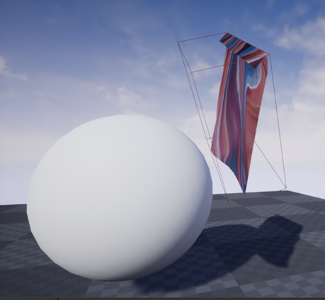
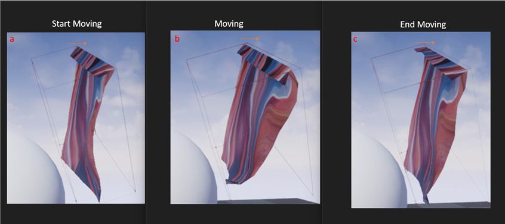
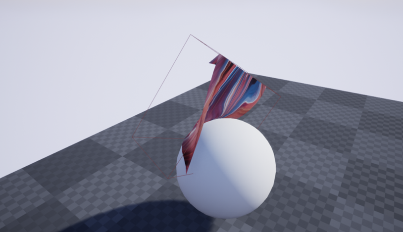
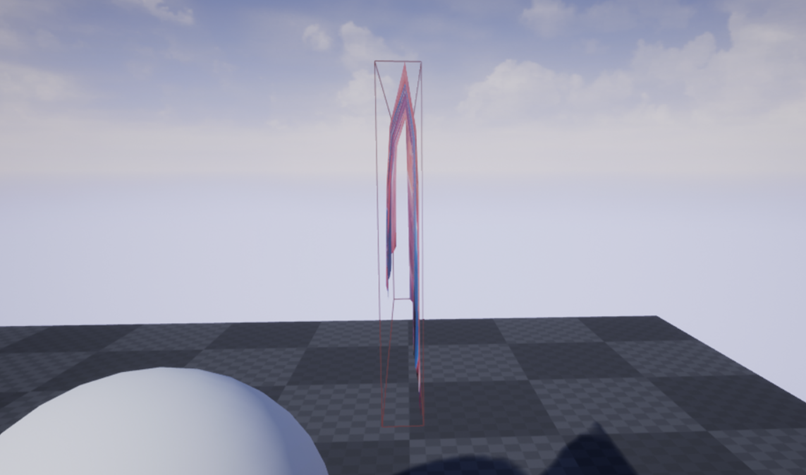
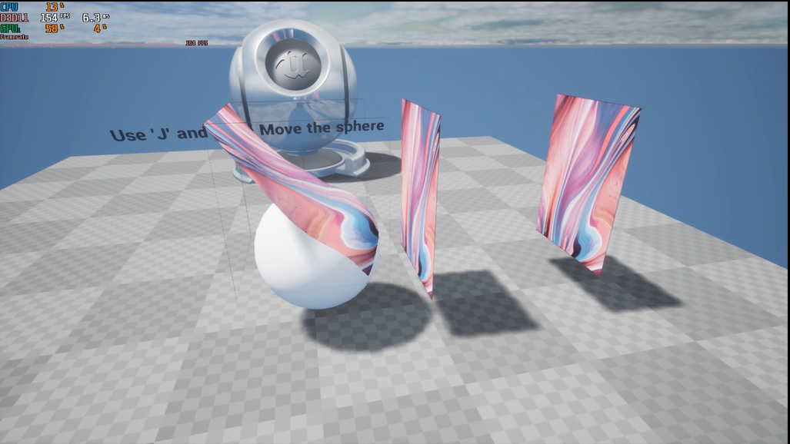

# RTClothVR

This project is used for learning real-time cloth simulation and exploring the feasibility of performing real-time cloth simulation for VR applications. The cloth model basically comes from D. Baraff and A. Witkin's "Large steps in cloth simulation":

>"
D. Baraff and A. Witkin, “Large steps in cloth simulation,” Proceedings of the 25th annual conference on Computer graphics and interactive techniques  - SIGGRAPH ’98, 1998, doi: https://doi.org/10.1145/280814.280821."

## Integrators and Their Support Hardware

| Integrator | CPU | GPU Computer Shader|
|------------|-----|--------------------|
| Implicit | :white_check_mark: | :white_large_square: |
| LeapFrog | :white_check_mark:  | :white_large_square: |
| Verlet | :white_check_mark:  | :white_check_mark: |

## Support Features

- [x] Cloth Self-Collision Detection and Response
- [x] Cloth-Object Collision Detection and Response
- [x] Positional Constraints
  - [x] Fix on plane
  - [x] Fix on a line
  - [x] Fix position

- [x] Velocity Constraints
- [x] External forces

## How to use this plugin

- Download UE4.

- `git clone https://github.com/NANAnoo/RTClothVR.git`
- Launch the UE4 Editor by double clicking `RTClothVR.uproject`.
- Add Component `RTClothMesh` to one of the static mesh actors in the game scene. It should look like the figure below:

- Simulation parameters can be modified in the detail panel's `Cloth Parameters` section.

## Some of the results

Positional Constraints

Velocity Constraints

External Collision

Internal Collision

Simulating three pieces of cloth which have size of 64 x 64

